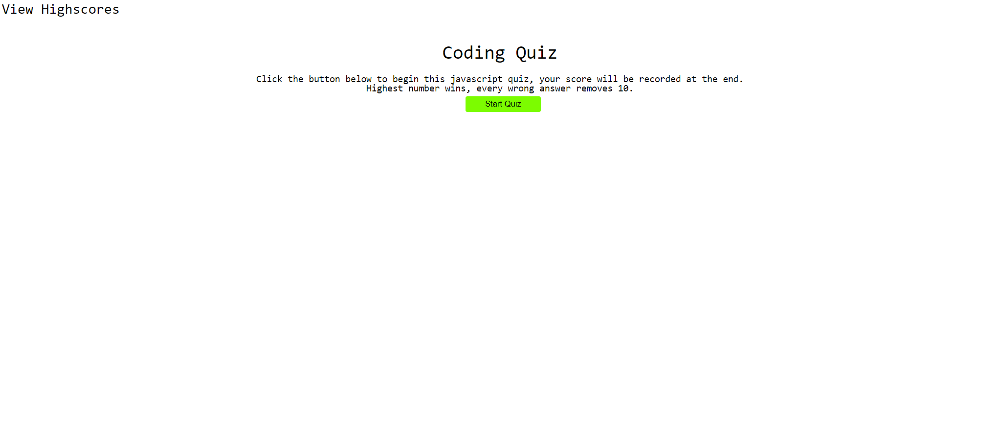
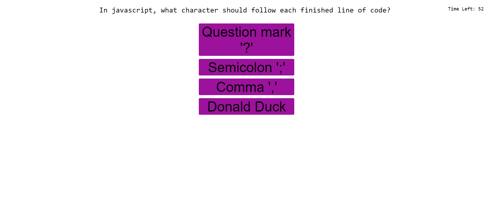

# code_quiz_TJ

## About

This projects was about creating an interactive javascript quiz, with questions refering to the same language.

It contains multiple different sections, such as the fisrt page which contains a link to the highscores (which carry over page refresh) a brief introduction, and a start button. Pressing said button begins the quiz, and you are presented with a series of questions and a decreasing timer. Upon finishing the quiz, you can input your name or initals to save it to the scoreboard, which can be wiped on button press.

## Challenges Faced

This project really focused on its use of Javascript, and while I am somewhat happy with the end product, I feel that alot of other feature could be implimented if I had the time.
Such as random questions and more questions, using more for loops the automate the code writing process, checks for what could be entered in the initals form.
I found working with the local storage to be a bit tricky, with its inability to store anything other than a string, but using JSON worked around this issue.

## The Final Product

live application available at [code_quiz_TJ](https://tomjia98.github.io/code_quiz_TJ/)

## Contact

for more information, feel free to contact me at Tomjia1998@gmail.com
